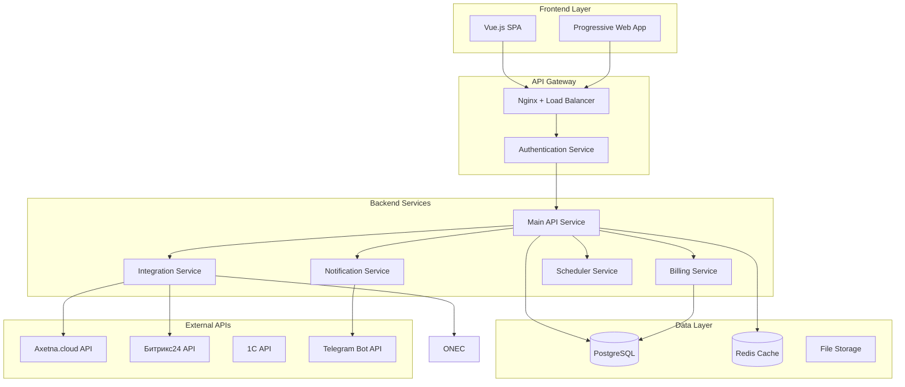

# Документ проектирования

## Обзор

Axetna CRM System - это мультитенантная веб-платформа, построенная на микросервисной архитектуре с использованием Go для backend и Vue.js для frontend. Система обеспечивает изолированные экосистемы для каждой компании с интеграцией к axetna.cloud API и внешним системам (Битрикс24, 1С, мессенджеры).

## Архитектура

### Общая архитектура системы



### Мультитенантная архитектура

Система использует подход "Schema-per-tenant" для изоляции данных компаний:

- Каждая компания получает отдельную схему в PostgreSQL
- Middleware определяет компанию по JWT токену
- Динамическое переключение схем на уровне ORM
- Отдельные учетные данные axetna.cloud для каждой компании

## Компоненты и интерфейсы

### Frontend компоненты (Vue.js)

#### Основные модули:
1. **Dashboard Module** - панель управления с виджетами
2. **Objects Module** - управление объектами мониторинга
3. **Users Module** - управление пользователями и ролями
4. **Billing Module** - биллинг и тарификация
5. **Installation Module** - планирование монтажей
6. **Warehouse Module** - управление складом
7. **Reports Module** - система отчетности
8. **Settings Module** - настройки и справочники

#### Архитектура компонентов:
```
src/
├── components/
│   ├── common/          # Общие компоненты
│   ├── dashboard/       # Виджеты панели управления
│   ├── objects/         # Компоненты объектов
│   ├── users/           # Управление пользователями
│   ├── billing/         # Биллинг компоненты
│   ├── installation/    # Планирование монтажей
│   ├── warehouse/       # Складские компоненты
│   └── reports/         # Отчеты
├── stores/              # Pinia stores
├── services/            # API сервисы
├── router/              # Vue Router
└── utils/               # Утилиты
```

### Backend сервисы (Go)

#### Main API Service
```go
// Основные контроллеры
type Controllers struct {
    ObjectController      *ObjectController
    UserController        *UserController
    BillingController     *BillingController
    InstallationController *InstallationController
    WarehouseController   *WarehouseController
    ReportController      *ReportController
    TemplateController    *TemplateController
    ContractController    *ContractController
    DirectoryController   *DirectoryController
}

// Middleware для мультитенантности
type TenantMiddleware struct {
    DB *gorm.DB
}

func (tm *TenantMiddleware) SetTenant(c *gin.Context) {
    // Извлечение tenant_id из JWT
    // Переключение схемы БД
}
```

#### Integration Service
```go
type IntegrationService struct {
    AxetnaClient  *AxetnaClient
    BitrixClient  *BitrixClient
    OneCClient    *OneCClient
}

type AxetnaClient struct {
    BaseURL string
    Credentials map[string]*TenantCredentials // По tenant_id
}
```

#### Notification Service
```go
type NotificationService struct {
    TelegramBot *TelegramBot
    EmailSender *EmailSender
    SMSSender   *SMSSender
}

type NotificationTemplate struct {
    ID       uint
    Type     string
    Template string
    Channels []string
}
```

## Модели данных

### Основные сущности

```go
// Компания (Tenant)
type Company struct {
    ID              uint      `gorm:"primaryKey"`
    Name            string    `gorm:"not null"`
    AxetnaLogin     string    `gorm:"not null"`
    AxetnaPassword  string    `gorm:"not null"` // Зашифрован
    DatabaseSchema  string    `gorm:"not null"`
    IsActive        bool      `gorm:"default:true"`
    CreatedAt       time.Time
    UpdatedAt       time.Time
}

// Объект мониторинга
type Object struct {
    ID          uint      `gorm:"primaryKey"`
    Name        string    `gorm:"not null"`
    Type        string    `gorm:"not null"`
    Status      string    `gorm:"default:'active'"`
    ContractID  uint      `gorm:"not null"`
    Contract    Contract  `gorm:"foreignKey:ContractID"`
    TemplateID  *uint
    Template    *ObjectTemplate `gorm:"foreignKey:TemplateID"`
    LocationID  uint
    Location    Location  `gorm:"foreignKey:LocationID"`
    ScheduledDeleteAt *time.Time
    CreatedAt   time.Time
    UpdatedAt   time.Time
    DeletedAt   *time.Time `gorm:"index"`
}

// Пользователь
type User struct {
    ID         uint      `gorm:"primaryKey"`
    Username   string    `gorm:"uniqueIndex;not null"`
    Email      string    `gorm:"uniqueIndex;not null"`
    Password   string    `gorm:"not null"`
    RoleID     uint      `gorm:"not null"`
    Role       Role      `gorm:"foreignKey:RoleID"`
    TemplateID *uint
    Template   *UserTemplate `gorm:"foreignKey:TemplateID"`
    IsActive   bool      `gorm:"default:true"`
    LastLogin  *time.Time
    CreatedAt  time.Time
    UpdatedAt  time.Time
}

// Роль пользователя
type Role struct {
    ID          uint         `gorm:"primaryKey"`
    Name        string       `gorm:"not null"`
    Permissions []Permission `gorm:"many2many:role_permissions;"`
    CreatedAt   time.Time
    UpdatedAt   time.Time
}

// Договор
type Contract struct {
    ID           uint                `gorm:"primaryKey"`
    Number       string              `gorm:"not null"`
    ClientName   string              `gorm:"not null"`
    StartDate    time.Time           `gorm:"not null"`
    EndDate      time.Time           `gorm:"not null"`
    TariffPlanID uint                `gorm:"not null"`
    TariffPlan   TariffPlan          `gorm:"foreignKey:TariffPlanID"`
    Appendices   []ContractAppendix  `gorm:"foreignKey:ContractID"`
    Objects      []Object            `gorm:"foreignKey:ContractID"`
    IsActive     bool                `gorm:"default:true"`
    CreatedAt    time.Time
    UpdatedAt    time.Time
}

// Приложение к договору
type ContractAppendix struct {
    ID         uint      `gorm:"primaryKey"`
    ContractID uint      `gorm:"not null"`
    Number     string    `gorm:"not null"`
    Description string
    StartDate  time.Time `gorm:"not null"`
    EndDate    time.Time `gorm:"not null"`
    IsActive   bool      `gorm:"default:true"`
    CreatedAt  time.Time
    UpdatedAt  time.Time
}

// Тарифный план
type TariffPlan struct {
    ID          uint      `gorm:"primaryKey"`
    Name        string    `gorm:"not null"`
    Description string
    PricePerObject decimal.Decimal `gorm:"type:decimal(10,2)"`
    IsActive    bool      `gorm:"default:true"`
    CreatedAt   time.Time
    UpdatedAt   time.Time
}

// Монтаж
type Installation struct {
    ID           uint         `gorm:"primaryKey"`
    ObjectID     uint         `gorm:"not null"`
    Object       Object       `gorm:"foreignKey:ObjectID"`
    InstallerID  uint         `gorm:"not null"`
    Installer    Installer    `gorm:"foreignKey:InstallerID"`
    Type         string       `gorm:"not null"` // монтаж/диагностика
    Status       string       `gorm:"default:'planned'"`
    ScheduledAt  time.Time    `gorm:"not null"`
    CompletedAt  *time.Time
    Equipment    []Equipment  `gorm:"many2many:installation_equipment;"`
    Notes        string
    CreatedAt    time.Time
    UpdatedAt    time.Time
}

// Монтажник
type Installer struct {
    ID           uint      `gorm:"primaryKey"`
    Name         string    `gorm:"not null"`
    Type         string    `gorm:"not null"` // штатный/наемный
    Phone        string
    Email        string
    Specialization []string `gorm:"type:text[]"`
    LocationIDs  []uint    `gorm:"type:integer[]"`
    IsActive     bool      `gorm:"default:true"`
    CreatedAt    time.Time
    UpdatedAt    time.Time
}

// Оборудование
type Equipment struct {
    ID          uint      `gorm:"primaryKey"`
    Type        string    `gorm:"not null"`
    Model       string    `gorm:"not null"`
    SerialID    string    `gorm:"uniqueIndex"`
    IMEI        string    `gorm:"uniqueIndex"`
    PhoneNumber string
    Status      string    `gorm:"default:'in_stock'"`
    ObjectID    *uint
    Object      *Object   `gorm:"foreignKey:ObjectID"`
    CreatedAt   time.Time
    UpdatedAt   time.Time
}

// Локация
type Location struct {
    ID        uint      `gorm:"primaryKey"`
    City      string    `gorm:"not null"`
    Region    string
    Latitude  *float64
    Longitude *float64
    IsActive  bool      `gorm:"default:true"`
    CreatedAt time.Time
    UpdatedAt time.Time
}

// Шаблоны
type ObjectTemplate struct {
    ID          uint      `gorm:"primaryKey"`
    Name        string    `gorm:"not null"`
    Config      string    `gorm:"type:jsonb"` // JSON конфигурация
    Description string
    CreatedAt   time.Time
    UpdatedAt   time.Time
}

type UserTemplate struct {
    ID          uint      `gorm:"primaryKey"`
    Name        string    `gorm:"not null"`
    RoleID      uint      `gorm:"not null"`
    Role        Role      `gorm:"foreignKey:RoleID"`
    Permissions string    `gorm:"type:jsonb"` // Дополнительные права
    Description string
    CreatedAt   time.Time
    UpdatedAt   time.Time
}
```

## Обработка ошибок

### Стратегия обработки ошибок

1. **Централизованная обработка ошибок**
```go
type APIError struct {
    Code    int    `json:"code"`
    Message string `json:"message"`
    Details string `json:"details,omitempty"`
}

func ErrorHandler() gin.HandlerFunc {
    return func(c *gin.Context) {
        c.Next()
        
        if len(c.Errors) > 0 {
            err := c.Errors.Last()
            // Логирование и возврат структурированной ошибки
        }
    }
}
```

2. **Типы ошибок**
- Ошибки валидации данных
- Ошибки авторизации и аутентификации
- Ошибки интеграции с внешними API
- Ошибки базы данных
- Бизнес-логические ошибки

3. **Retry механизмы для интеграций**
```go
type RetryConfig struct {
    MaxRetries int
    Delay      time.Duration
    Backoff    time.Duration
}

func (c *AxetnaClient) CallWithRetry(request *http.Request, config RetryConfig) (*http.Response, error) {
    // Реализация retry логики с экспоненциальным backoff
}
```

## Стратегия тестирования

### Уровни тестирования

1. **Unit тесты**
- Тестирование бизнес-логики сервисов
- Тестирование утилитарных функций
- Покрытие не менее 80%

2. **Integration тесты**
- Тестирование API endpoints
- Тестирование интеграций с внешними системами
- Тестирование работы с базой данных

3. **E2E тесты**
- Тестирование критических пользовательских сценариев
- Автоматизация через Cypress или Playwright

### Тестовая инфраструктура

```go
// Тестовая база данных
func SetupTestDB() *gorm.DB {
    db, _ := gorm.Open(sqlite.Open(":memory:"), &gorm.Config{})
    // Миграции тестовых схем
    return db
}

// Мокирование внешних API
type MockAxetnaClient struct {
    Responses map[string]*http.Response
}

func (m *MockAxetnaClient) CreateObject(obj *Object) error {
    // Мок реализация
}
```

### CI/CD Pipeline

```yaml
# .github/workflows/test.yml
name: Test Pipeline
on: [push, pull_request]
jobs:
  test:
    runs-on: ubuntu-latest
    services:
      postgres:
        image: postgres:13
        env:
          POSTGRES_PASSWORD: test
    steps:
      - uses: actions/checkout@v2
      - uses: actions/setup-go@v2
      - name: Run tests
        run: |
          go test ./... -v -coverprofile=coverage.out
          go tool cover -html=coverage.out -o coverage.html
```